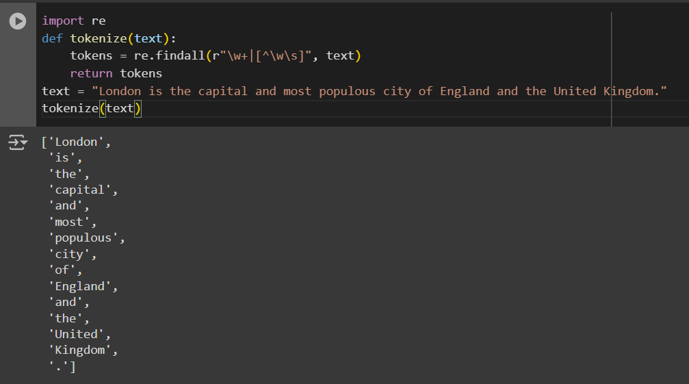
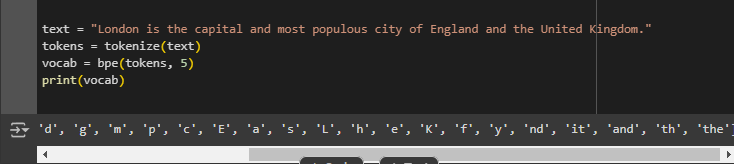
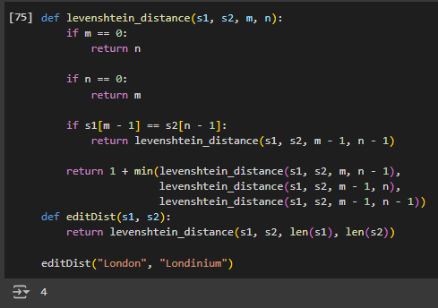
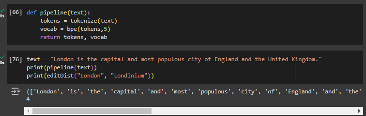

# Prueba de entrada

## Tokenización con regex:

The function to 'split' the input corpus was implemented, this code uses ``\w`` which only accepts alphanumeric characters and _. We use the Kleene operator ``+``, which generates a pattern that searches for one or more occurrences of the previous character (in this case over ``\w``). Then, the disjunction operator ``|`` is used to search for other characters, which we group using brackets. The caret symbol is used after the bracket to negate everything inside, and the content is ``\w\s``, which includes alphanumeric characters, _, and whitespace. Therefore, this part of the regular expression will search for other symbols that are not alphanumeric characters, such as punctuation marks.

```py
import re
def tokenize(text):
    tokens = re.findall(r"\w+|[^\w\s]", text)
    return tokens
```



## Aplicación de byte pair encoding (BPE)

First we define the function bpe that get the corpus (tokenized) and the number of iterations. The corpus will merge the words but with the characters spaced out, it will create the vocabulary with the characters, find the frequency pairs by selecting the maximum. Then, it will merge this pair within the corpus and add this new pair to the vocabulary.

```py
def get_pair_frequencies(corpus):
    pairs = {}
    for word in corpus:
        symbols = word.split()
        for i in range(len(symbols) - 1):
            pair = (symbols[i], symbols[i + 1])
            if pair in pairs:
                pairs[pair] += 1
            else:
                pairs[pair] = 1
    return pairs

def merge_pair(corpus, pair):
    merged_corpus = []
    bigram = ' '.join(pair)
    replacement = ''.join(pair)
    
    for word in corpus:
        new_word = word.replace(bigram, replacement)
        merged_corpus.append(new_word)
    return merged_corpus

def bpe(corpus, num_iterations):
    corpus = [' '.join(list(word)) for word in corpus]
    vocab = set(' '.join(corpus).split())
    vocab = list(vocab)

    for _ in range(num_iterations):
        pair_frequencies = get_pair_frequencies(corpus)
        if not pair_frequencies:
            break
        
        most_frequent_pair = max(pair_frequencies, key=pair_frequencies.get)

        corpus = merge_pair(corpus, most_frequent_pair)
        
        vocab.append(''.join(most_frequent_pair))
    return vocab
```



## Cálculo de distancia de edición:

For the calculation of edit distance, we use the Levenshtein distance, which takes both strings and their lengths to convert the first into the second.

We perform the comparison from the last character backwards, and there are only two cases (they are either the same or not). If they are the same, we proceed to calculate the distance of the substrings. Otherwise, we need to insert, remove, or replace to transform string 1 into string 2. If string 1 is empty, the only option is to add the remaining characters from string 2, and if string 2 is empty, the only option is to remove all characters from string 1. Finally, we perform these three operations recursively and take the one with the smallest value, this code was extracted for GeeksForGeeks.

```py
def levenshtein_distance(s1, s2, m, n):
    if m == 0:
        return n

    if n == 0:
        return m

    if s1[m - 1] == s2[n - 1]:
        return levenshtein_distance(s1, s2, m - 1, n - 1)

    return 1 + min(levenshtein_distance(s1, s2, m, n - 1),
                   levenshtein_distance(s1, s2, m - 1, n),
                   levenshtein_distance(s1, s2, m - 1, n - 1))
def editDist(s1, s2):
    return levenshtein_distance(s1, s2, len(s1), len(s2))
```



## Integración en un pipeline

We integrated the three components into a function where it takes the text as input, tokenizes it, and applies the BPE algorithm.

```py
def pipeline(text):
    tokens = tokenize(text)
    vocab = bpe(tokens,5)
    return tokens, vocab
```

